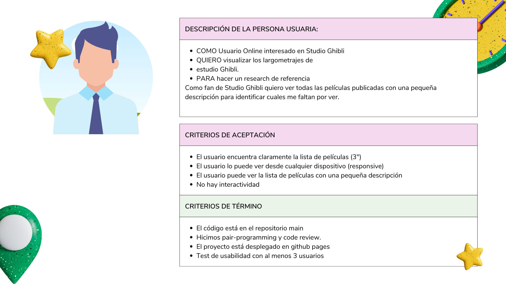
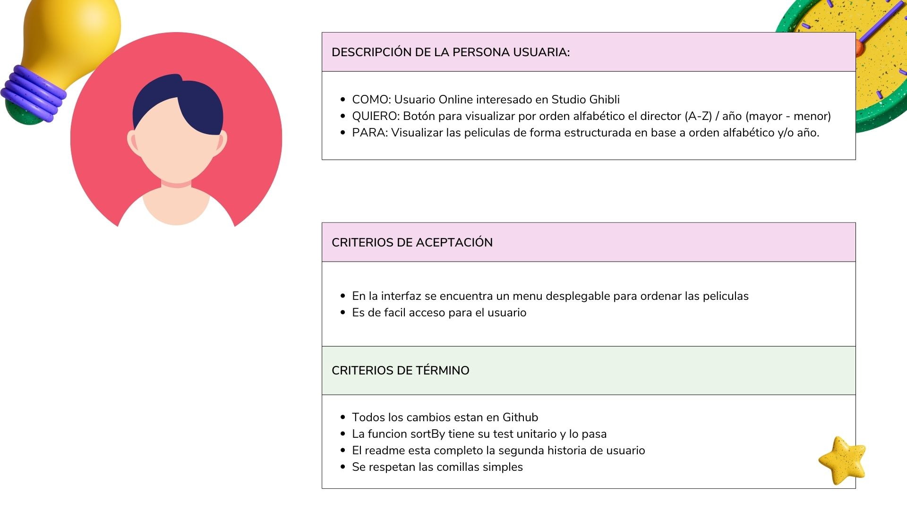
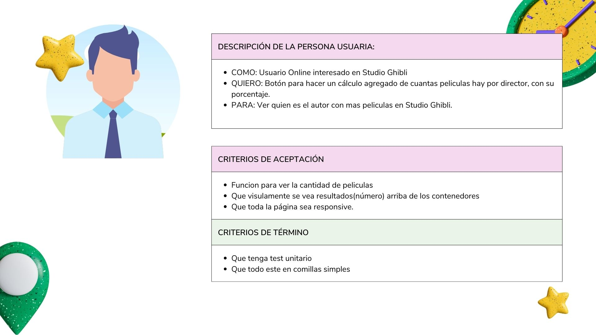
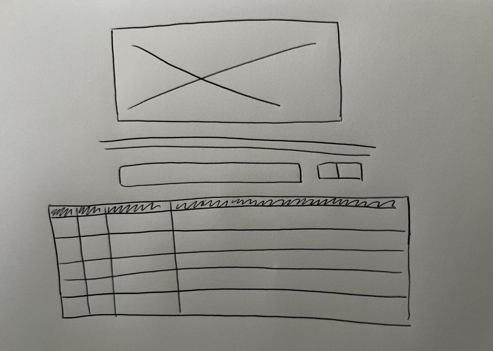
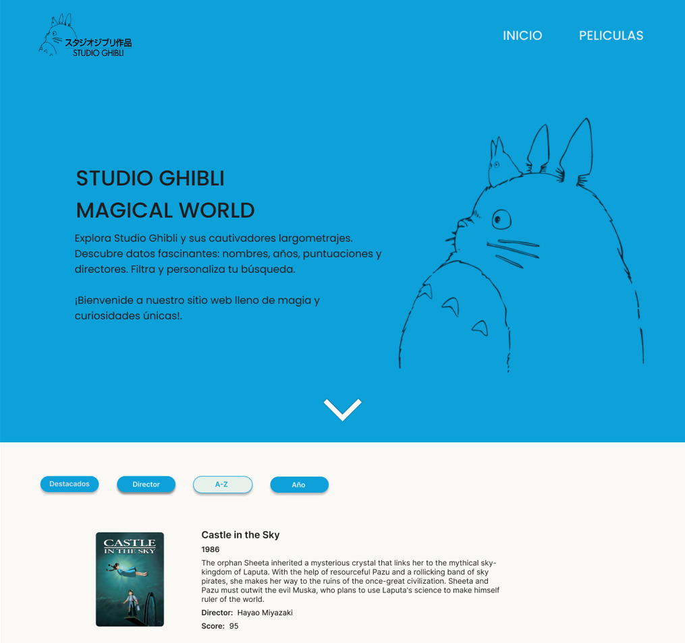
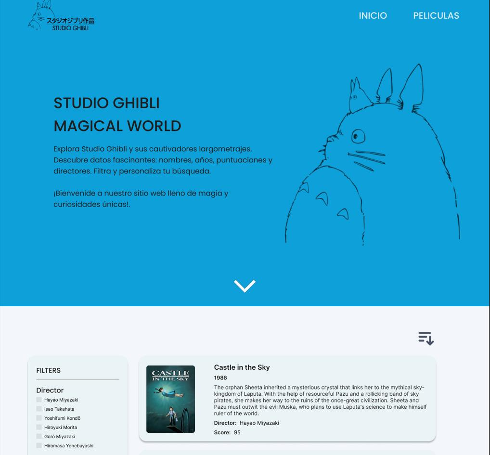
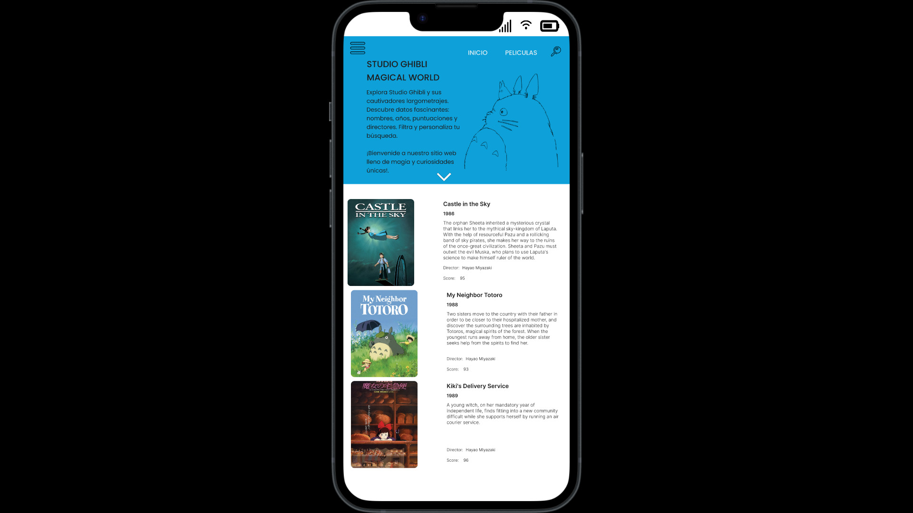
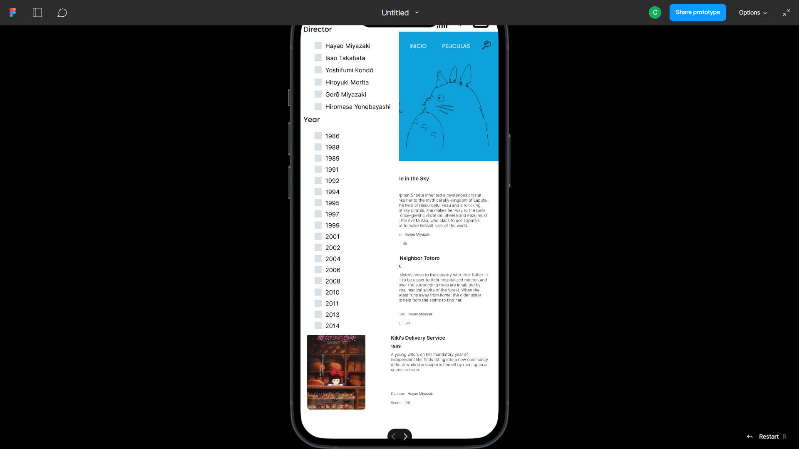
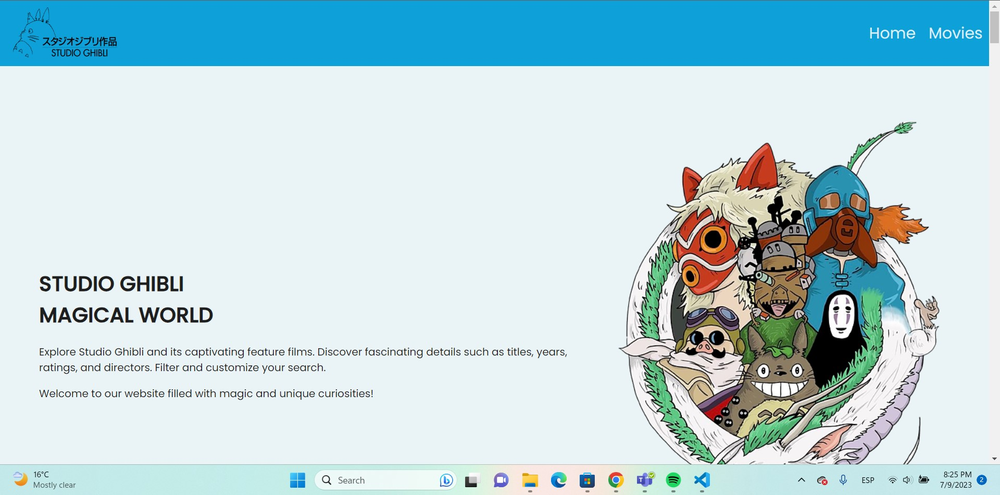
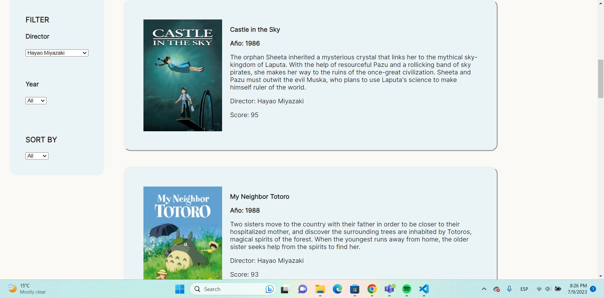

# Data Lovers

## Índice

* [1. Preámbulo](#1-preámbulo)
* [2. Resumen del proyecto](#2-resumen-del-proyecto)
* [3. Herramientas](#3-herramientas)
* [4. Historias de usuario](#4-historias-de-usuario)
* [5. Prototipos](#5-prototipos)
* [6. Resultado](#6-resultado)

***

## 1. Preámbulo

El objetivo del proyecto fue crear una pagina web para visualizar un conjunto de datos segun la necesidad del usuario. En esta pagina se puede visualizar, filtrar, ordenar y tener información de conteo y porcentaje sobre la data de las peliculas de Studio Ghibli para mostrar información aun mas relevante para los usuarios.

## 2. Resumen del proyecto

Como bien mencionamos, la tematica elegida fue Studio Ghibli y para saber qué y como tuvimos que tener un estudio de usuario, en el que descubrimos los siguientes datos:

1.- Los principlaes usuarios del producto son personas

2.- Los objetivos de los usuarios en relacion con el producto son saber cuantas y cuales son las peliculas lanzadas por Studio Ghibli, su fecha de lanzamiento, director, sinopsis y el score dado a cada una.

3.-Los usuarios utilizarían nuestro producto para consultar las peliculas creadas, 

## 3. Herramientas

Los lenguajes utilizados fueron HTML semántico, CSS y JavaScript Vanilla. Se crearon e implementaron test unitarios y se utilizo flexbox y media querys.

## 4. Historias de Usuario

#### Historia de usabilidad 1

#### Historia de usabilidad 2

#### Historia de usabilidad 3

#### Historia de usabilidad 4

## 5. Prototipos
Trabajamos en la elaboración de un prototipo a papel , luego uno de alta fidelidad el cual fue evaluado por nuestras compañeras de las cuañes recibimos feedback para posteriormente y después d eaplicar las sugerencias , volver a solicitarles ayuda en el test de usabilidad.

#### Prototipo de baja fidelidad

#### Prototipos de alta fidelidad

 Prototipo dinámico: [prototipo dinamico](https://www.figma.com/file/Za2IZjJeFvbyY29Qm8RnY7/DL---Prototipo-alta-2?type=design&mode=design&t=SW1ZTLeklR9Bb0Pm-0)

#### Listado de problemas de usabilidad detectados 

Hicimos test de usabilidad recibiendo como feedback los siguiente.
Usuario 1 : No encontro el boton de ordenar, deberia haber un boton para resetear la busqueda, no deberian ocultarse los filtros, si habia posibilidad de que viera un pop up al darle click a una pelicula o a la imagen o que diera mas informacion(hacker edition),

Uusario 2: No encontró botón de ordenado, demoró 1 minuto , hacerlo más vistoso o ponerlo del lado de los filtros, botón de reset ,

Se llegó a las siguientes conclusiones:

1.Hacer ORDER vistoso o de lado izquierdo.
2.Boton de limpiar información (filtros y de ordenado).
3.Considerar hacer una lista desplegable para que solo elijan 1 filtro.
4.El checkbox para el hacker edition si había tiempo.
Por lo que el prototipo de alta fidelidad se modifico de la siguiente manera.

Se realizo también la versión mobile, considerando una lista desplegable donde se puedan seleccionar los filtros y el orderby.

Usamos para el diseño de ambos protipos [Figma](https://www.figma.com/) 

### Pruebas unitarias

Nuestro proyecta cuenta con test para las funciones encargadas de  _procesar_,
_filtrar_ y _ordenar_ la data, así como _calcular_ estadísticas.

Las _pruebas unitarias_ tienen una cobertura del 70% de _statements_
(_sentencias_), _functions_ (_funciones_), _lines_ (_líneas_), y _branches_
(_ramas_) del archivo `src/data.js` que contiene nuestras funciones.

## 6. Resultado

