# Data Lovers

## Índice

* [1. Definición del producto](#1-definición-del-producto)
* [2. Historias de usuario](#2-historias-de-usuario)
* [3. Prototipos de baja fidelidad](#3-prototipos-de-baja-fidelidad)
* [4. Prototipos de baja fidelidad](#4-prototipos-de-alta-fidelidad)
* [5. Resultados de test de usuabilidad](#5-resultados-de-test-de-usuabilidad)
* [6. Panificación del Proyecto](#6-planificación-del-proyecto)
* [7. Contribuidoras](#6-contribuidoras)

***

## 1. Definición del producto

El producto 'Countries' es una aplicación web que proporciona información detallada sobre países de todo el mundo. Permite a los usuarios explorar y buscar países, acceder a datos relevantes como su capital, población, idiomas oficiales, zonas horarias y más. Además, ofrece funcionalidades de filtrado y clasificación para ayudar a los usuarios a encontrar países según sus preferencias. El producto también incluye una interfaz intuitiva y amigable, que permite una navegación fácil y una experiencia agradable para los usuarios. Con 'Countries', los usuarios pueden ampliar su conocimiento sobre diferentes países y acceder rápidamente a información clave para diversos propósitos como viajes, estudios, investigaciones y más.

### Características principales

* Información detallada de países: Proporciona datos exhaustivos sobre países, incluyendo su nombre, capital, población, idiomas oficiales, zonas horarias, entre otros.

* Búsqueda de países: Permite a los usuarios buscar países específicos utilizando un cuadro de búsqueda, lo que facilita la localización rápida de información sobre un país en particular.

* Filtrado de países: Ofrece opciones de filtrado para ayudar a los usuarios a encontrar países según diferentes criterios, como continente, subregión y ordenamiento por población.

* Clasificación de países: Permite ordenar los países en función de la población, ya sea en orden ascendente o descendente, lo que permite obtener una visión general de los países más y menos poblados.

* Interfaz intuitiva: Cuenta con una interfaz fácil de usar y amigable, que facilita la navegación y la exploración de los datos de los países.

* Diseño responsive: La aplicación está diseñada para adaptarse a diferentes dispositivos y tamaños de pantalla, lo que garantiza una experiencia consistente tanto en computadoras de escritorio como en dispositivos móviles.

### Público objetivo

El público objetivo de "Countries" puede ser amplio y diverso, ya que el producto brinda información y herramientas útiles para cualquier persona interesada en explorar y conocer más sobre países de todo el mundo. Algunos posibles segmentos de público objetivo podrían incluir:

* **Viajeros y entusiastas de los viajes:** Aquellos que disfrutan viajando y desean obtener información detallada sobre diferentes países antes de planificar sus viajes.

* **Estudiantes y académicos:** Personas que buscan datos e información confiable sobre países para proyectos académicos, estudios de investigación o aprendizaje general.

* **Profesionales y empresarios internacionales:** Individuos involucrados en negocios internacionales que necesitan conocer información relevante sobre países, como datos demográficos, indicadores económicos y culturales.

* **Curiosos y entusiastas de la cultura:** Personas interesadas en aprender sobre la diversidad cultural, tradiciones, idiomas y costumbres de diferentes países.

* **Expatriados y migrantes:** Individuos que planean o están viviendo en un país extranjero y desean obtener información detallada sobre su destino actual o potencial.

En resumen, el público objetivo de "Countries" abarca a cualquier persona que tenga interés en explorar y obtener información precisa y confiable sobre países de todo el mundo, ya sea por motivos personales, académicos, profesionales o de viaje.

### Funcionalidades

Los Filtros utilizados en "Countries" incluyen:

1. **Filtro por continente:** Permite a los usuarios seleccionar un continente específico para ver los países correspondientes a esa región geográfica.

2. **Filtro por lenguaje:** Permite a los usuarios filtrar los países según los idiomas oficiales hablados en cada país. Esto ayuda a los usuarios a encontrar países que compartan un idioma común.

3. **Filtro por subregión:** Permite a los usuarios filtrar los países según una subregión específica, lo que ayuda a refinar la búsqueda y explorar países más específicos dentro de una región.

4. **Filtro y ordenamiento por población:** Permite ordenar los países según su población, ya sea de forma ascendente (de menor a mayor) o descendente (de mayor a menor), lo que permite visualizar los países más o menos poblados en función de las necesidades del usuario.

5. **Filtro por área:** Permite a los usuarios filtrar los países según su área geográfica, lo que ayuda a identificar países más grandes o más pequeños en términos de superficie terrestre.

6. **Densidad de población:** Junto con la información de población, se muestra la densidad de población de cada país, que es el número de personas por unidad de área. Esto proporciona una perspectiva sobre la concentración de la población en cada país.

7. Adicionamente se agrego un **cálculo relacionado con el promedio de la densidad poblacional por continentes**, esto brinda una visión comparativa de la densidad de población promedio en diferentes regiones del mundo.

### Cómo usar la aplicación

1. Accede a la aplicación [aquí](https://andreastefbustos.github.io/DEV009-data-lovers/src)
2. Una vez cargada la página, verás un listado de países en la pantalla principal. Puedes comenzar a explorar esta lista o utilizar las funcionalidades de búsqueda y filtrado para encontrar países específicos.
3. Búsqueda de países: En la barra de búsqueda, puedes ingresar el nombre común del país, y los resultados se irán mostrando a medida que escribes. Haz clic en el país deseado para ver su información detallada, como capital, si el país es independiente o no, y su zona horaria.
4. Al lado izquierdo encontrarás un aside con filtros disponibles como: continente, lenguaje, sub-región, población, área y densidad de población.
5. Al ingresar en población, área o densidad de población podrás ordenarla de manera ascendente o descendente.
6. Estadísticas y cálculos agregados: En la aplicación, encontrarás estadísticas agregadas, como el promedio de densidad de población por continente. Estos datos te brindarán una visión general de las diferencias demográficas entre los continentes.
7. En contrarás una lista de letras de la A-Z donde podrás seleccionar alguna de ellas y mostrará los nombres de los países que pertenecen a dicha letra a su vez, encontrarás un `ALL` que al hacer clic mostrará de nuevo toda la lista de los países.

### Diseño de la página

### Paleta de colores 

Se elegi la siguiente paleta de colores por su:
* Versatilidad
* Enfoque en el contenido
* Elegancia y simplicidad
* Mejor legibilidad

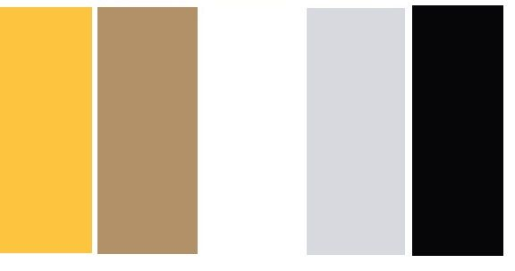

### Tipografía utilizada

* Encabezados y tílulos : Stoke
* Texto de la lista de los países: Sans-serif
* Aside: Georgia

### Iconografía

Se utilizaron algunos íconos en el proyecto, la cual fueron tomados de la siguiente página:

* [Icono de menú](https://stock.adobe.com/ca/images/id/551953059?k=menu+icon&clickref=1101lwV2J3GJ&mv=affiliate&mv2=Freepik&as_camptype=&as_channel=affiliate&as_source=partnerize&as_campaign=Flaticon&as_content=api&as_audience=srp&sdid=6WTV6YJ5&asset_id=551953059)

* [Icono de Sort](https://www.flaticon.com/free-icon/sort_4662255?term=sort&page=1&position=3&origin=search&related_id=4662255)

### Tecnologías utilizadas 

En este proyecto, se utilizaron las tecnologías fundamentales de desarrollo web: **JavaScript**, **HTML** y **CSS**. Cada una de estas tecnologías desempeña un papel clave en la creación de una página web dinámica, atractiva y funcional.

**HTML (HyperText Markup Language)** es el lenguaje de marcado estándar utilizado para estructurar el contenido de una página web. Con HTML, se definen los elementos y la organización de la información, como encabezados, párrafos, imágenes, enlaces y otros elementos visuales.

**CSS (Cascading Style Sheets)** se encarga de la presentación y el diseño visual de una página web. Con CSS, se pueden definir estilos, como colores, fuentes, márgenes, tamaños y posiciones de los elementos HTML. Esto permite personalizar la apariencia de la página y lograr un diseño coherente y atractivo.

**JavaScript** es un lenguaje de programación de alto nivel que se utiliza para agregar interactividad y funcionalidad a una página web. Con JavaScript, se pueden realizar acciones dinámicas en respuesta a eventos, como hacer que los elementos cambien de estilo, realizar validaciones de formularios, mostrar y ocultar contenido, y comunicarse con servicios web para obtener y mostrar datos actualizados.

Al combinar estas tres tecnologías, **JavaScript**, **HTML** y **CSS**, se crea una base sólida para el desarrollo web. **JavaScript** proporciona la capacidad de interactuar con el usuario y realizar acciones dinámicas, HTML estructura el contenido y CSS da estilo y diseño a la página. Juntas, estas tecnologías permiten crear experiencias web atractivas y funcionales para los usuarios.

### Control de versiones

Se ha utilizado Git como sistema de control de versiones para mantener un registro detallado de los cambios realizados en el proyecto.

## 2. Historias de usuario

### *Historia de Usuario 1*

Mostrar los nombres comunes de los países más la imagen de la bandera.

* **Yo como** estudiante académico ó persona interesada en el tema sobre países.

* **Quiero** ver el listado de los países con sus respectivos nombres comunes y la imagen de las banderas.

* **Para** saber si la base de datos tiene incluido el país del cual necesito buscar información.

#### Criterios de Aceptación

* Al desplegarse la UI el usuario pueda ver una página con los nombres comunes de los países y sus banderas ordenados alfabéticamente y agrupados por letras.
* Podrá realizar scroll

#### Definición de terminado

* El código cumple con la guía de estilos acordada.
* El código está subido al repositorio.
* El código tiene y pasa las tests necesarios.
* El código ha sido hecho, al menos en parte, en pair-programming y alguien le hizo code-review.
* La historia implementada ha sido testeada con al menos 3 usuarios y se han incorporado la mejoras que se identificaron en esos testeos de usabilidad.

### *Historia de Usuario 2*

Tener una caja de texto (Buscador) donde el usuario ingrese el país que desea ver, escribiendo en minúsculas ó mayúsculas.

* **Yo como** estudiante académico ó persona interesada en el tema sobre países.

* **Quiero** escribir en un buscar ó caja de texto, un país de mi selección.

* **Para** que se me facilité al momento de realizar la búsqueda correspondiente.
#### Criterios de Aceptación

* La página principal deberá tener un input que será una caja de texto, este será el buscador.
* Al momento de escribir algún nombre este se podrá escribir en minúsculas, mayúsculas ó las dos al mismo tiempo es decir ej. AbCd.
* La página principal también tendrá 2 botonos, 1. para limpiar el input y la lista de los países generada y 2. que deberá mostrar de nuevo la lista de los países con sus nombres comunes y respectivas banderas nuevamente.

#### Definición de terminado

* El código cumple con la guía de estilos acordada.
* El código está subido al repositorio.
* El código tiene y pasa las tests necesarios.
* El código ha sido hecho, al menos en parte, en pair-programming y alguien le hizo code-review.
* La historia implementada ha sido testeada con al menos 3 usuarios y se han incorporado la mejoras que se identificaron en esos testeos de usabilidad

### *Historia de Usuario 3*

#### *Historia de Usuario #3.1*

Incluir un navegador con las letras del alfabeto de la A-Z, para realizar un filtrado por letra.

* **Yo como** estudiante académico ó persona interesada en el tema sobre países.

* **Quiero** poder visualizar un navegador donde incluya el alfabeto con las letras de la A-Z.

* **Para** poder realizar mas fácil el proceso de búsqueda.

#### Criterios de Aceptación

* La página principal deberá tener un navegador donde aparece la palabra ALL y las letras de la A-Z en mayúscula.
* Este navegador deberá ir en el centro de la página y tener las propiedades de responsive.
* Al momento de seleccionar alguna letra, en el listado de países solo debe de verse reflejado los nombre de los países de la letra seleccionada.
* Al momento de hacer click en ALL deberá de aparecer la lista completa de los países con sus respectivas bandera nuevamente.

#### Definición de terminado

* El código cumple con la guía de estilos acordada.
* El código está subido al repositorio.
* El código tiene y pasa las tests necesarios.
* La historia implementada ha sido testeada con al menos 3 usuarios y se han incorporado la mejoras que se identificaron en esos testeos de usabilidad.

#### *Historia de Usuario #3.2.1*

Implementar un Aside donde se podrán implementar diferentes filtros mostrando información básica, como: continente (calculo agregado de promedio de densidad población por continente), lenguaje, subregión, población, área, densidad poblacional (Desktop y mobile con la version de un menú que se despliegará el mismo aside con dicha información "versión responsive").

* **Yo como** estudiante académico ó persona interesada en el tema sobre países.

* **Quiero** poder visualizar un aside con acceso a filtros por: continente, lenguaje, subregión, población, área, densidad poblacional. 

* **Para** poder filtrar toda la data y solo visualizar los países que cumplan alguno de los criterios anteriores.

#### Criterios de Aceptación

* En la página principal se deberá visualizar un aside con su respectiva información: continente, lenguaje, subregión, población, área, densidad poblacional (Desktop aside).
* Se deberá realizar un proceso de filtrado para cada categoría.
* Los filtros se visulizaran.

#### Definición de terminado

* El código cumple con la guía de estilos acordada.
* El código está subido al repositorio.
* El código tiene y pasa las tests necesarios.
* La historia implementada ha sido testeada con al menos 3 usuarios y se han incorporado la mejoras que se identificaron en esos testeos de usabilidad.

### *Historia de Usuario 4*

Hacer click en el nombre del país y desplegar información relevante, como: capital, si el país es independiente, y su zona horaria.

* **Yo como** estudiante académico ó persona interesada en el tema sobre países.

* **Quiero** poder seleccionar un país y que este se despliegue una ventana con cierta información relevante de dicho país.

* **Para** conocer sobre: capital, país independiente y zona horaria.

#### Criterios de Aceptación

* Cuando el usuario hace click en el nombre de un país se debe abrir una vista con toda la información disponible del país seleccionado la cual será: capital, país independiente y zona horaria.
* Luego al volver hacer click la información debe de esconderse nuevamente.

#### Definición de terminado

* El código cumple con la guía de estilos acordada.
* El código está subido al repositorio.
* El código tiene y pasa las tests necesarios.
* La historia implementada ha sido testeada con al menos 3 usuarios y se han incorporado la mejoras que se identificaron en esos testeos de usabilidad.

## 3. Prototipos de baja fidelidad

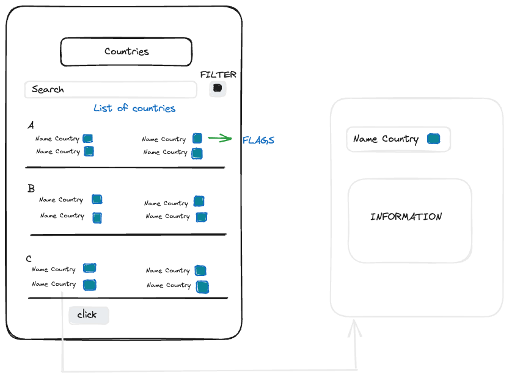

## 4. Prototipos de alta fidelidad

* DESKTOP

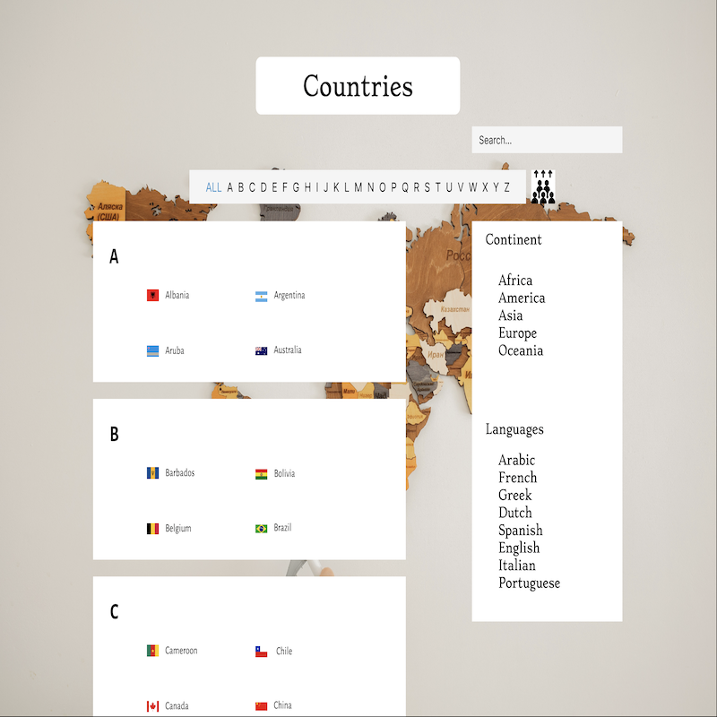

* MOBILE

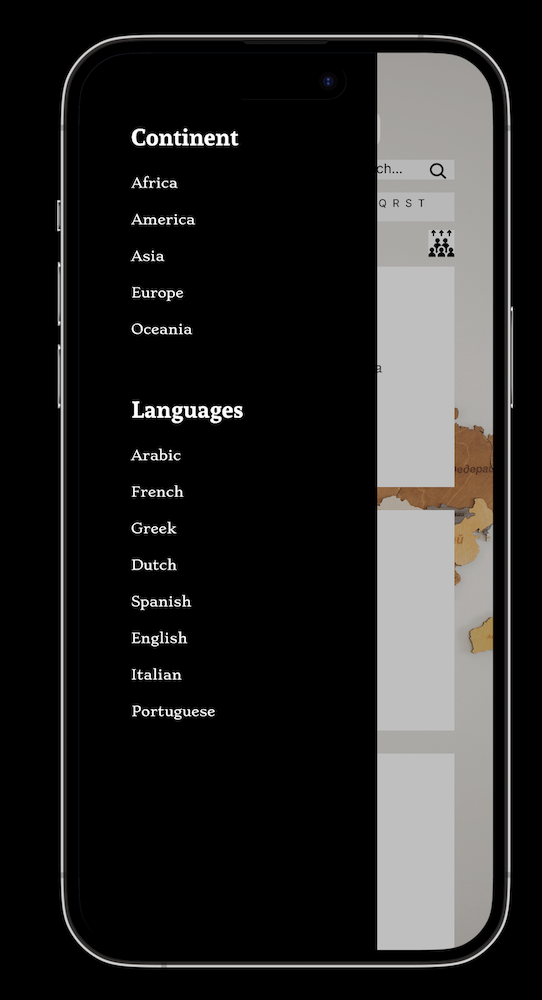

Se obtuvieron algunos feedback 

* Paulina Torres
* Diana Morales
* Mafer Orostegui

**Propuesta de Pulina:**

*Para desktop:*

buscaria otra imagen no queda claro para que es este boton, o quizas indicar "haz click aqui para ver detalle de la poblacion" por ejemplo tipo hover
a nivel experiencia usuario me gusta queda claro para que es la pagina, si en css redondearia los bordes para que no se vean tan toscos, unificandolos cuadraros como el del titulo "countries"

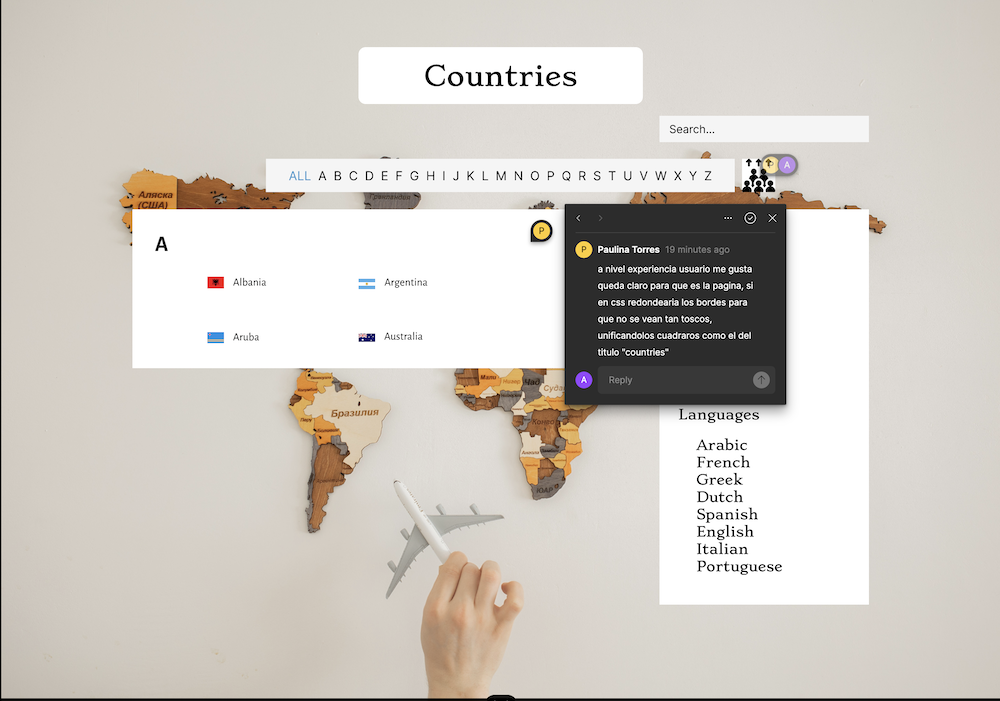

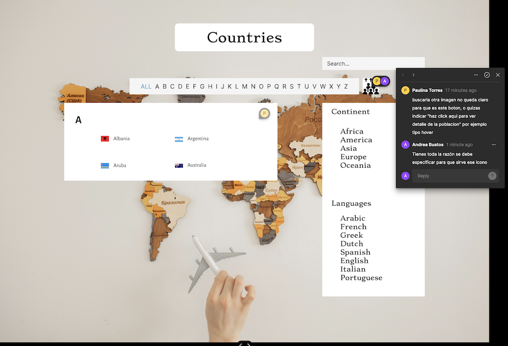

*Para mobile:*

intentaria agrandar mas la letra
me encanta como lograron hacer el responsive de escritorio a mobile, bonito y elegante.

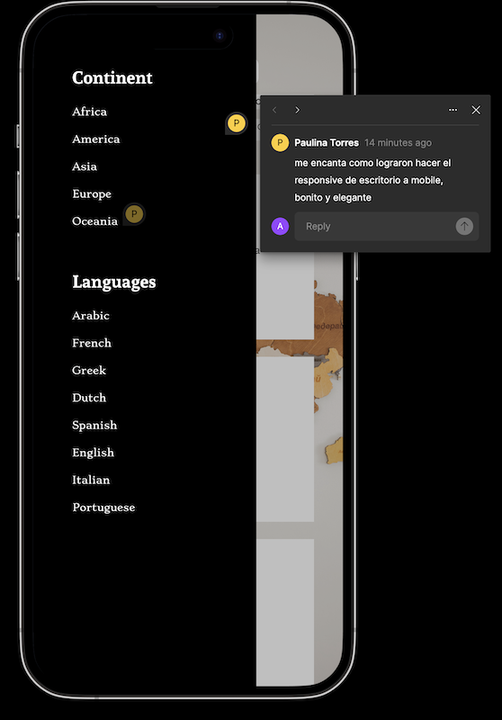

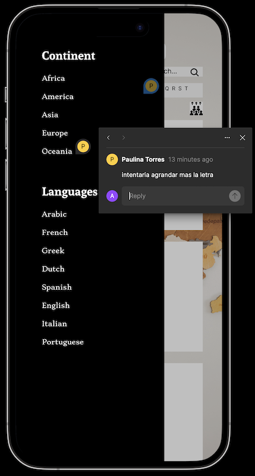

**Propuesta de Mafer:**

*Para desktop:*

Considero que la estructura está limpia y la jerarquización también. Es tan serio como esperaría que lo fuera una app que me brinde información de este tipo😍 Me encanta!

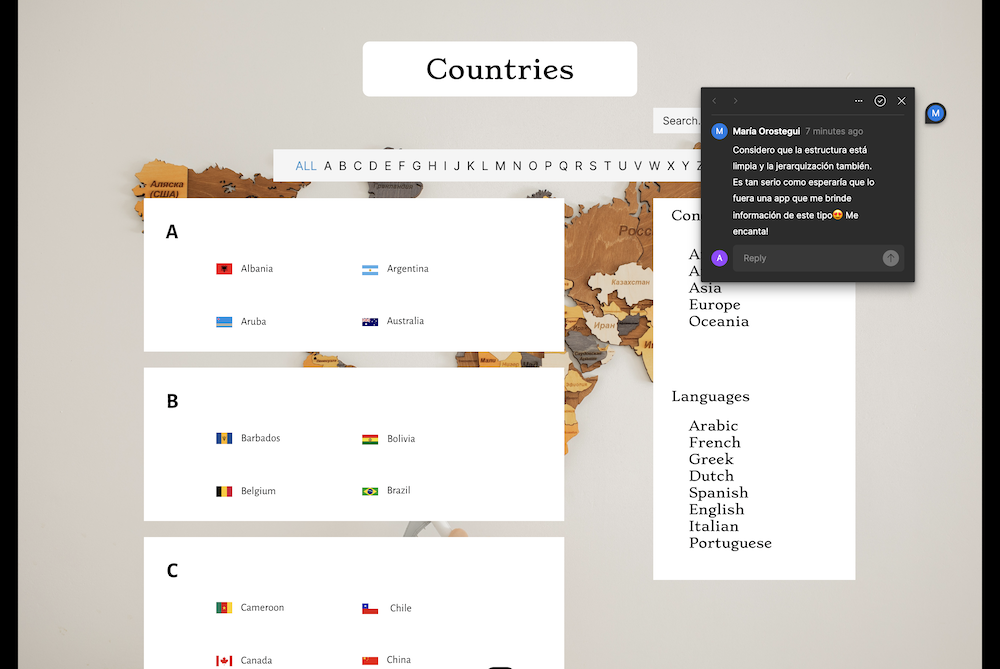

*Para mobile:*

Para empezar me encanta lo minimalista y ordenado que luce, es refrescante para mi mente!! En el caso de este search sería estupendo que tuviese más protagonismo; por lo demás todo está perfecto😍

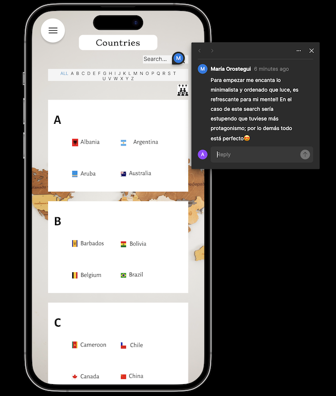

**Propuesta de Diana:**

*Para desktop - mobile*

Me gusto: la organización, La forma en la que esta estructurado, esta muy centrado al tema en si que es sobre Geografía, la forma del botón, o del área donde están ubicados los países por el abc me gusto también, y el fondo le da un toque serio pero lindo. Lo único que en lo personal me gustaría, quizás viéndolo por el lado de visitar Una pagina de geografía de forma informativa, sería dar conceptos, o un área en donde pueda ver como mas descripción a modo educativo(nose si sea tema de siguientes HU, pero sería lo único). De resto esta espectacular.

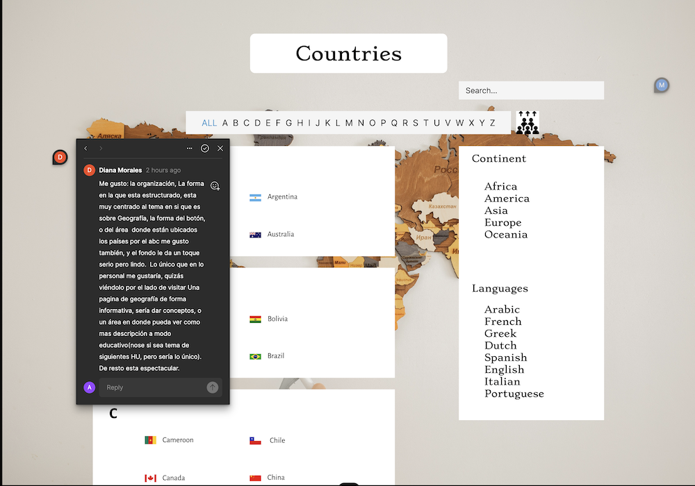

* [Figma-Desktop](https://www.figma.com/proto/tgf3DAVycUWTtnuDKdBF11/Desktop?type=design&node-id=1-2&scaling=min-zoom&page-id=0%3A1&starting-point-node-id=1%3A2)
* [Figma-Mobile](https://www.figma.com/proto/6dInw57EZ80kufTQlwPLwC/Mobile?type=design&node-id=6-322&scaling=scale-down&page-id=0%3A1&starting-point-node-id=2%3A206)

## 5. Resultados de test de usuabilidad

El objetivo principal de los tests de usabilidad fue evaluar la facilidad de uso y la experiencia del usuario en nuestra plataforma de Countries. Durante las pruebas, se le pidió a un grupo de participantes que realizaran diversas tareas específicas, como filtrar los países según diferentes criterios, explorar la información detallada de cada país y utilizar la función de búsqueda para encontrar países específicos.

Estos tests nos proporcionaron valiosa retroalimentación sobre la usabilidad del sitio web. Observamos cómo los participantes interactuaban con los filtros, cómo encontraban la información que buscaban y qué dificultades o confusiones encontraban en el proceso. Además, nos permitieron identificar áreas de mejora y realizar ajustes necesarios para optimizar la experiencia del usuario.

Gracias a la utilización de la página real en los tests de usabilidad, obtuvimos una retroalimentación más precisa y relevante. Esto nos permitió tomar decisiones informadas y realizar mejoras concretas en el diseño, la navegación y la funcionalidad del sitio web de Countries.

El test se realizó por medio de la herramienta Jotform: [Test Countries]([Figma-Mobile](https://www.figma.com/proto/6dInw57EZ80kufTQlwPLwC/Mobile?type=design&node-id=6-322&scaling=scale-down&page-id=0%3A1&starting-point-node-id=2%3A206))

**Las preguntas realizadas fueron:**

1. Encuentras intuitivo el uso de los filtros de la página?
2. Los filtros te permiten encontrar la información que buscas de manera eficiente?
3. La página muestra claramente los resultados filtrados?
4. Te resulta fácil cambiar entre diferentes tipos de filtros (ej. subregión, lenguaje, población, area, densidad poblacional y continentes)?
5. Los resultados de los filtros son consistentes y precisos?
6. Encuentras que los filtros cubren tus necesidades de búsqueda?
7. La página proporciona opciones de ordenamiento de resultados después de aplicar los filtros?
8. Encuentras algún problema técnico o de rendimiento al utilizar los filtros?
9. De ser la respuesta afirmativa, nos puedes comentar cuales son?
10. Tienes alguna sugerencia o mejora para hacer que la experiencia de la página sea aún mejor?

[Reporte del Test](https://www.jotform.com/report/23181030645704701?st=cnNOdzd3TitXKy9mcnpybTY0c2hRWEJpRDRuV1NGNW1XazR3aWIyUldSL3lYYlpheTZENlBsbWMzSlBlZWxlTXlnbUV5THZVUlZxWnVHT3NSQ1VFN3JGY2p6Ykl0MDQrczhkSkFoY0swRElVdHBKQ0V3SDZTbklNSlZsQlRkby8=)

## 6. Panificación del Proyecto

Hemos llevado a cabo la planificación de nuestro proyecto utilizando Trello, una herramienta de gestión de proyectos en línea. Trello ha sido una pieza fundamental en nuestro enfoque ágil y colaborativo, permitiéndonos organizar y supervisar de manera efectiva cada etapa de nuestro proyecto de Countries.

En Trello, creamos un tablero principal que representa nuestro flujo de trabajo. Dividimos el tablero en diferentes listas, cada una representando una fase del proyecto, como "Backlog of Product", "Backlong of Sprint", "Bloqueos", "Doing" y "Done". Esto nos permite visualizar de manera clara y ordenada el progreso del proyecto y las tareas pendientes en cada etapa.

Dentro de cada lista, creamos tarjetas para cada tarea específica. Estas tarjetas contienen toda la información relevante, como descripción, asignación de miembros del equipo.

[Planificación - Trello](https://trello.com/b/pNuUJzcY/dev009-proyecto2-data-lovers)

## 7. Contribuidoras

* Alba Giraldo
* Andrea Stefania Bustos
