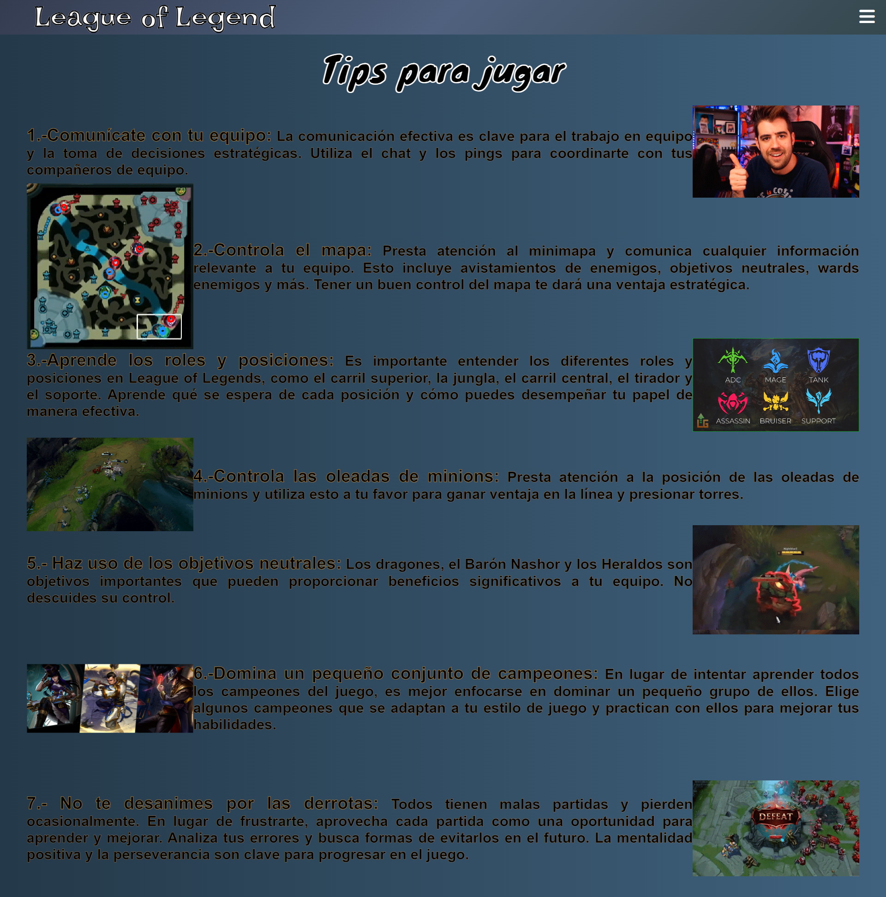
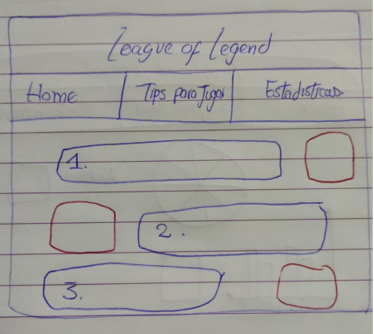
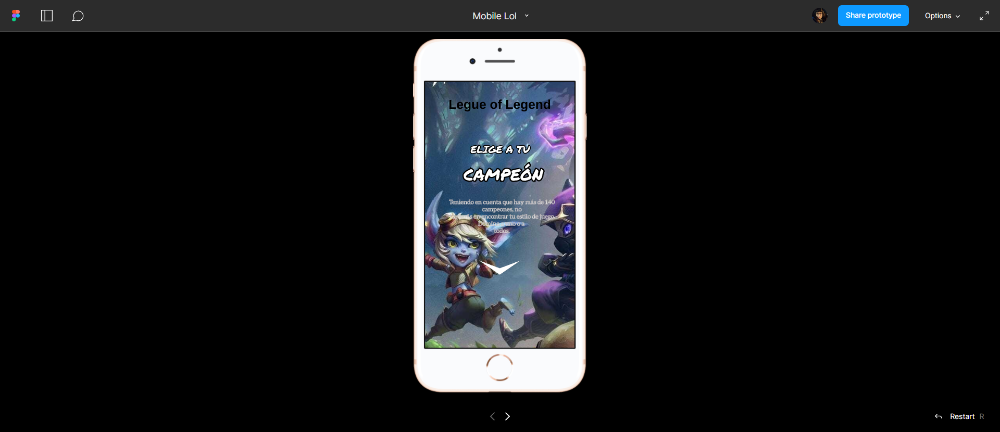

# DATA LOVERS  💚💻  - Pagina Web del Juego Legue of the Leguends  🎮

Link Proyecto: [Ir a la Página Web](https://andreasoncco.github.io/DEV009-data-lovers/src/)

## Índice

* [1. Definición del Proyecto](#1-definición-del-proyecto)
* [2. Proceso de Diseño y Desarrollo](#2-proceso-de-diseño-y-desarrollo)
* [3. Investigación UX](#3-investigación-ux)
* [4. Diseño UI](#4-diseño-ui)
* [5. Herramientas de Elaboración](#5-herramientas-de-elaboración)

***

## 1. DEFINICIÓN DEL PROYECTO

Nuestra página web es sobre el popular juego en línea Legue of Legends, destinado a los nuevos jugadores o personas interesadas en obtener información resumida del juego para formar sus equipos y conocer que personajes les conviene elegir según el perfil de cada quien. En el sitio web podrás encontrarte con tres segmentos principales: la página Home, la página Tips para Jugar y la página Estadísticas. Asimismo, el sitio web es Responsive Design ya que se ajusta al tamaño de disitivos mobiles, tablets y destops.

A continuación se muestra la imagen final del sitio:

**Bienvenida**

**Página Home**

**Página Tips para Jugar**

**Página Estadísticas**

## 2. PROCESO DE DISEÑO Y DESARROLLO

## 3. INVESTIGACIÓN UX

### 3.1. ¿Quiénes son los principales usuarios del producto?​

Los usuarios que son los fanáticos del juego que están interesados en obtener información detallada sobre los campeones y las personas interesadas en videojuegos. Según la edad, mayormente niños y jóvenes.​

### 3.2. ¿Cuáles son los objetivos de estos usuarios en relación con el producto?​

Los objetivos de estos usuarios en relación con nuestra página de información de campeones de League of Legends pueden incluir :​

- Saber cuál es el rol de cada campeón y cuantos roles hay.​

- Conocer los distintos niveles de ataque, defensa, velocidad o poder de cada campeón.​

- Conocer los distintos tipos de habilidades inherentes o adquiridas de cada campeón.​

### 3.3. ¿Cuáles son los datos más relevantes que quieren ver en la interfaz y por qué?​

Se espera visualizar los roles que hay, que rol tiene cada campeón y la información detallada de cada campeón para poder tener mayor información de los campeones que quieran usar, saber en qué momento se puede usar cada campeón y también como debemos equiparlos referente a su rol que cumple.​

### 3.4. ¿Cuándo utilizarían o utilizarían el producto?​

Antes de jugar los jugadores pueden utilizar la página para investigar y aprender sobre un nuevo campeón que desean probar antes de jugar con él  y también pueden usarlo durante el juego para poder mejorar o para que conozcan más de otros jugadores con los que no hayan jugado.​

## 4. DISEÑO UI

### 4.1. Prototipo de Baja Fidelidad

**Foto de Prototipo Inicial de Home, Tips para jugar y Estadísticas**

### 4.2. Prototipo de Alta Fidelidad

[Ir al prototipo interactivo de Figma](https://www.figma.com/proto/krEDURnZWSOr9hH0AOPQNG/Mobile-Lol?type=design&node-id=13-3&t=ayBDE23OER2F0p6a-1&scaling=scale-down&page-id=0%3A1&starting-point-node-id=13%3A3&mode=design)

### 4.4. Historias de Usuario

**Historia Uno​**

- Como: nuevo jugador de LoL que visitara la pagina​

- Quiero: ver el nombre y la imagen de cada campeón ​

- Para: conocer cada campeón ​

    **Criterios de Aceptación​**

    - Hacer una página  principal de Bienvenida para el usuario​

    - Mostrar una lista de todos los campeones disponibles con su imagen y su nombre.​

    **Definición de Terminado​**

    - Crear dos `<section>` para la pagina de Bienvenida y la pagina Home donde están los campeones​

    - Dentro del primer `<section>` crear un `<header>` donde este la Bienvenida​

    - Importar la data al `main.js`​

    - Presentar la data en el `index.html`​

**Historia Dos​**

- Como: jugador de lol​

- Quiero: poder filtrar y buscar campeones según su rol​

- Para: poder seleccionar rápidamente los campeones que se ajustan a la composición de mi equipo y al estilo de juego deseado. ​

    **Criterios de Aceptacion​**

    - Hacer una barra de navegación, donde se muestren los roles disponibles (luchador, tirador, mago, asesino, tanque, apoyo).​

    - Hacer un filtro según el rol​

    **Definición de Terminado​**

    - Crear un `<nav>` para hacer la barra de navegación de los roles​

    - Exportar las funciones `(ejemplo: filtroLuchador())` para filtrar en el data.js​

    - Presentar la data filtrada en el `index.html`.

    **Historia tres​**

- Como: jugador de lol​

- Quiero: poder ordedar los campeones por orden descendente y que con un botón se regrese a orden ascendente otra vez​

- Para: poder ver los capeones con nombres que su inicial comience con las últimas letras​

    **Criterios de Aceptación​**

    - Hacer una lista desplegable donde se muestre ordenar de A-Z y viceversa.​

    - Hacer una función para ordenar los campeones de A-Z y viceversa​

    **Definición de Terminado​**

    - Crear un `
` para hacer la lista desplegable del botón Ordenar​

    - Exportar las funciones `ordenarAZ()` y `ordenarZA()` en el `data.js`​

    - Presentar la data ordenada en el `index.html`​

**Historia cuarta​**

- Como: nuevo jugador de LoL que visitara la pagina​

- Quiero: ver algunos tips de como jugar o que me recomiendan hacer ​

- Para: poder jugar mejor y adaptarme mejor al juego​

    **Criterios de Aceptación ​**

    - Crear un menu de hamburguesa en el cual al hacer click, generé la opción "tips para jugar"​

    - Mostrar la pagina donde se presenten tips para jugar​

    - Incluir al lado de cada tips una imagen o un gif​

    **Definición de Terminado​**

    - Crear un `<nav>` para hacer el menu de hamburguesa​

    - Darle funcionalidad al botón de menu de hamburguesa​

    - Poner un `
` por cada tip e incluir un `` en la misma línea.

**Historia quinta​**

- Como: jugador de LoL​

- Quiero: poder acceder a un gráfico de torta que nos indique el número de campeones por cada rol​

- Para: saber en que rol puedo encontrar más variedad de personajes​

    **Criterios de Aceptacion:​**

    - Crear un botón que nos direcciones a la página de Estadísticas​

    - Presentar la pagina de Estadísticas con un gráfico de torta según los roles de los campeones​

    **Definición de Terminado​**

    - Crear un `<section>` donde vaya la parte de Estadísticas​

    - Crear la función `calcularRoles()` para generar el calculo agregado de cada rol​

    - Mostrar el gráfico de torta en el `index.html`.​

**Historia sexta​**

- Como: persona que quiere comenzar a jugar lol​

- Quiero: poder informarme con una descripcion básica de los campeones​

- Para: poder conocer un poco mas de los personajes y poder ver cual me gusta más para jugar con él ​

    **Criterios de Aceptación ​**

    - Convertir el nombre y la imagen de cada campeón en un botón que nos diriga a la pagina de su descripción​

    - Mostrar una pagina donde se muestre la descripción y la imagen por cada campeon​

    - Hacer un botón que nos regrese a la página inicial Home​

    **Definición de Terminado​**

    - Escuchar el evento "click" en el nombre o la imagen de cada campeon para direccionar a su descripción​

    - Crear un `<section>` y presentar la data de la descripción en `index.html`​

    - Incluir un `<a>` para crear el botón de retorno a la pagina inicial.

### 4.3. Testeo de Usabilidad

Según el testeo nos dimos cuenta que:

- Podríamos mover los filtros arriba de las películas.
- Simplificar el cómo se muestran las peliculas (ej: de a 3 películas por línea).
- Hay que agregar un "boton de volver" a la página de la película.
- Los personajes podríamos mostrarlos también en pequeñas tarjetitas.
- Se podría mostrar las locaciones y vehículos en una misma sección.

## 5. HERRAMIENTAS DE ELABORACIÓN

HTML, CSS, JavaScript.
