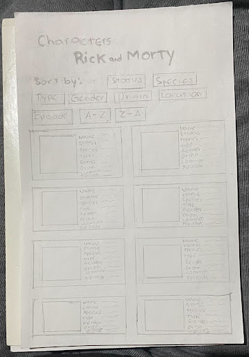
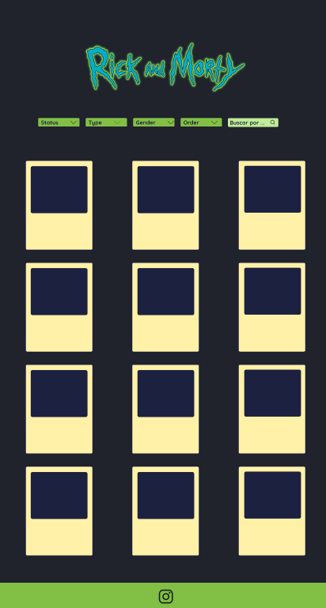
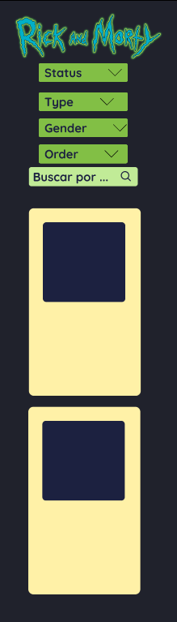
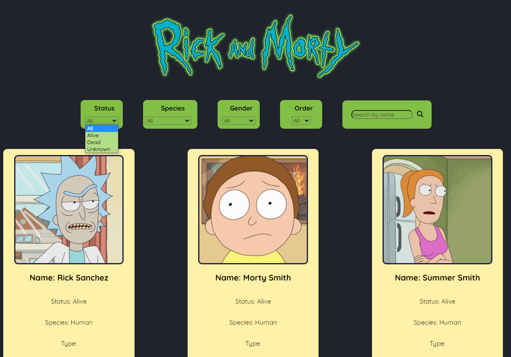
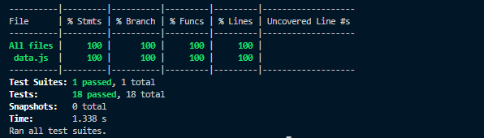

# Proyecto Data Lovers DEV009
## Rick and Morty

Puedes ver el proyecto finalizado [aquí](https://raudelgado.github.io/DEV009-data-lovers/)

## Índice

* [1. Nuestro Proyecto](#1-nuestro-proyecto)
* [2. Historias de Usuario](#2-historias-de-usuario)
* [3. Diseño de Interfaz de Usuario](#3-diseño-de-interfaz-de-usuario)
* [4. Test de Usabilidad](#4-test-de-usabilidad)
* [5. Objetivos de Aprendizaje](#5-objetivos-de-aprendizaje)
* [6. Proyecto finalizado](#6-proyecto-finalizado)

## 1. Nuestro proyecto

Este segundo proyecto perteneciente a la cohort DEV009, tenía como objetivo el construir una página web con cierta data para que los usuarios pudieran visualizarla. 

En nuestro caso, escogimos **Rick and Morty** para esta data, por lo que nos enfocamos en usuarios que observaran esta serie. 

En base a ellos, y con ayuda de una encuesta, trabajamos nuestras Historias de Usuario para así crear una página web útil, y además, responsive. 

## 2. Historias de Usuario

Luego de realizar la encuesta correspondiente, analizamos los resultados para así llegar a cuatro historias de usuario:

#### Primera Historia de Usuario

> "Yo como usuario, quiero visualizar los datos de los personajes de Rick y Morty, para tener un orden de la serie"

#### Segunda Historia de Usuario

> "Yo como usuario, quiero filtrar los datos de los personajes de Rick y Morty, para visualizar los datos en específico que se desee consultar"

#### Tercera Historia de Usuario

> "Yo como usuario, quiero ordenar los datos de los personajes de Rick y Morty, para obtener la información rápidamente."

#### Cuarta Historia de Usuario

> "Yo como usuario, quiero saber, a través de un porcentaje, como se divide los personajes del universo de la serie"

## 3. Diseño de Interfaz de Usuario

### Prototipo de baja fidelidad.

Al tener las cuatro historias de Usuario empezamos con el prototipo de baja fidelidad: 

### Prototipo de alta fidelidad

Al tener esto, empezamos a iterar las distintas opciones para que nuestro proyecto se fuera encaminando a lo que habíamos diseñado

**Vista completa**

**Vista desktop**

**Vista Android**

Puedes ver nuestro Figma [aquí](https://www.figma.com/proto/wPeetqLIez79gNBU77c0Vl/Prototipo-de-alta-fidelidad?type=design&node-id=144-103&t=AsGXROdn6ArSImXI-1&scaling=scale-down&page-id=0%3A1&mode=design)

## 4. Test de Usabilidad

Al principio, decidimos hacer una prueba de testeo con nuestro prototipo de baja, entendiendo si la cantidad de botones que esperabamos agregar eran simplemente demasiado. 

Cuando le hicimos los test de usabilidad con el prototipo de Alta Fidelidad tuvimos varios comentarios, el más destacado: 

* Al desplegar un select, los option que no seleccionabamos quedaban muy oscuros a comparación del resto. 

Esto lo volvimos a comprobar al realizar nuestro test en el deploy, donde ajustamos las tonalidades del option para que así se pudiese leer mucho mejor sin necesidad de estar seleccionado. 

## 5. Objetivos de Aprendizaje
    
### HTML

- [ ] **Uso de HTML semántico**

### CSS

- [ ] **Uso de selectores de CSS**

- [ ] **Modelo de caja (box model): borde, margen, padding**

- [ ] **Uso de flexbox en CSS**

### Web APIs

- [ ] **Uso de selectores del DOM**

- [ ] **Manejo de eventos del DOM (listeners, propagación, delegación)**

- [ ] **Manipulación dinámica del DOM**

### JavaScript

- [ ] **Diferenciar entre tipos de datos primitivos y no primitivos**

- [ ] **Arrays (arreglos)**

- [ ] **Objetos (key, value)**

- [ ] **Variables (declaración, asignación, ámbito)**

- [ ] **Uso de condicionales (if-else, switch, operador ternario, lógica booleana)**

- [ ] **Uso de bucles/ciclos (while, for, for..of)**

- [ ] **Funciones (params, args, return)**

- [ ] **Pruebas unitarias (unit tests)**

- [ ] **Módulos de ECMAScript (ES Modules)**

- [ ] **Uso de linter (ESLINT)**

- [ ] **Uso de identificadores descriptivos (Nomenclatura y Semántica)**

- [ ] **Diferenciar entre expresiones (expressions) y sentencias (statements)**

### Control de Versiones (Git y GitHub)

- [ ] **Git: Instalación y configuración**

- [ ] **Git: Control de versiones con git (init, clone, add, commit, status, push, pull, remote)**

- [ ] **Git: Integración de cambios entre ramas (branch, checkout, fetch, merge, reset, rebase, tag)**

- [ ] **GitHub: Creación de cuenta y repos, configuración de llaves SSH**

- [ ] **GitHub: Despliegue con GitHub Pages**

- [ ] **GitHub: Colaboración en Github (branches | forks | pull requests | code review | tags)**

#### Herramientas 

* Git
* GitHub
* GitHub Pages
* Node.js
* Jest 

## 6. Proyecto finalizado

**Vista final**

**Test Unitarios**

#### Desarrolladoras

* Rau Delgado | [GitHub](https://github.com/raudelgado) 
* Dulce Ramirez | [GitHub](https://github.com/Dulceramr)
