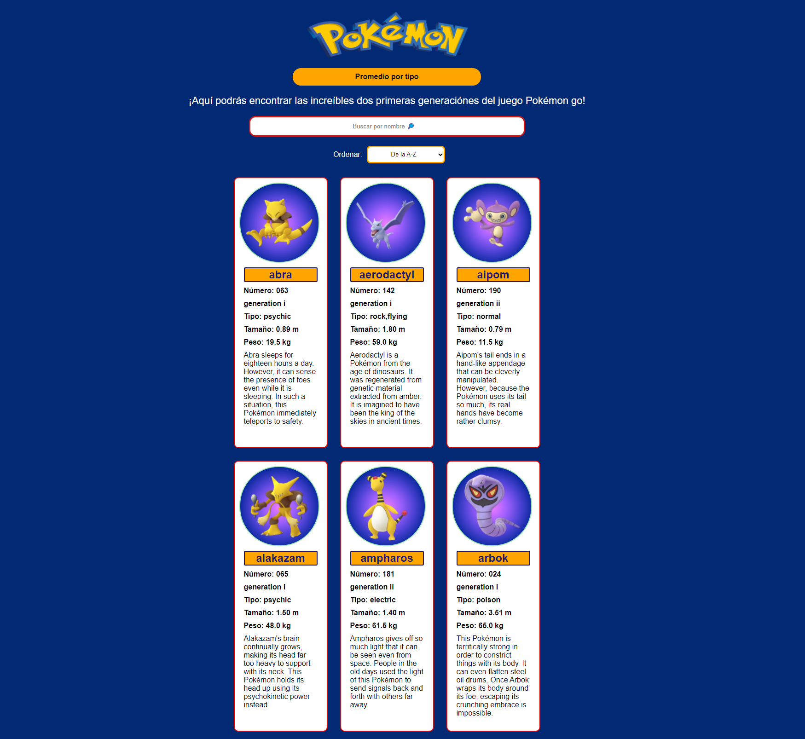
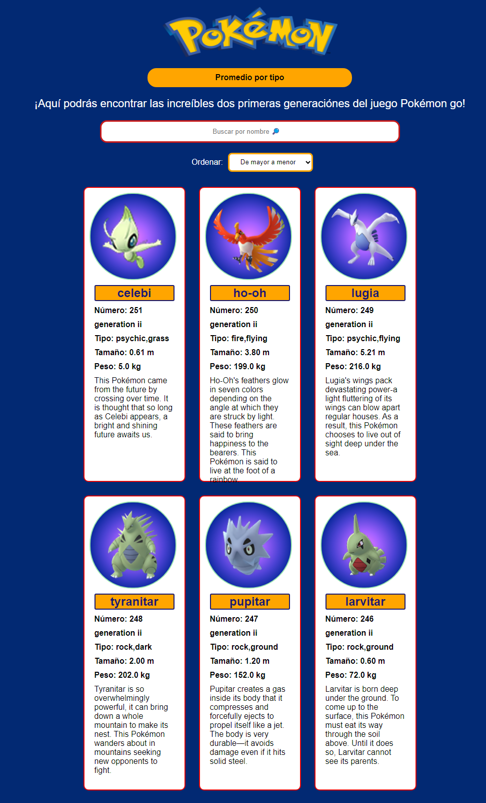
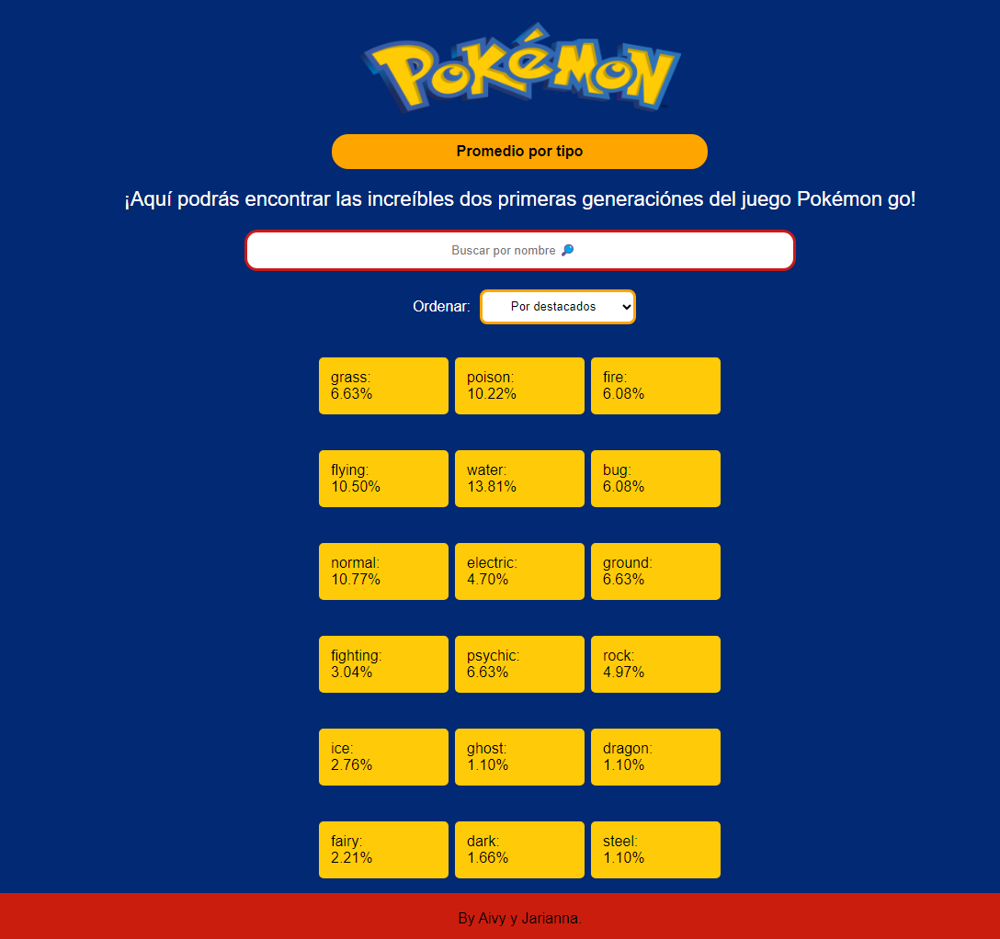
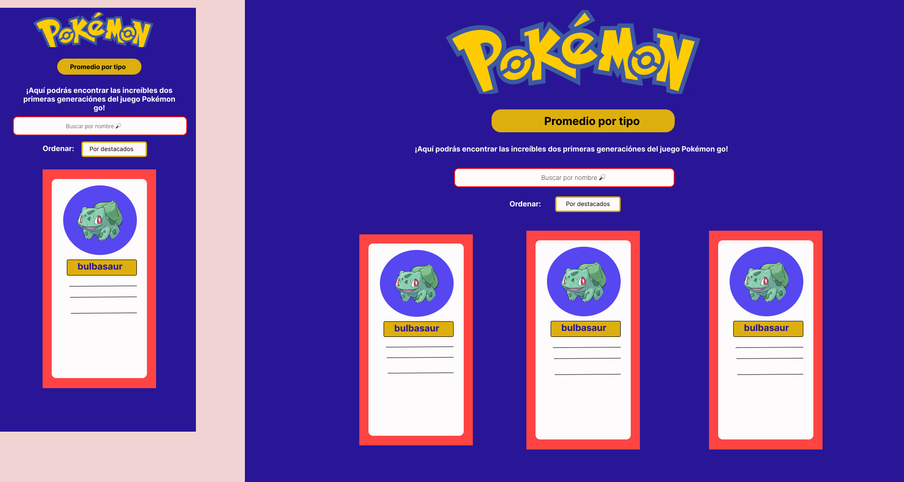
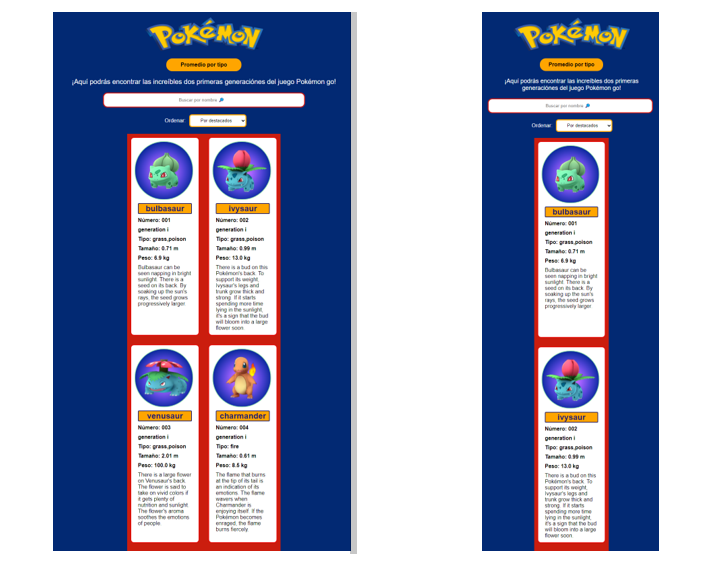

# Pokémon go! 

¡Bienvenido a nuestro sitio web dedicado a Pokémon GO!

 
 
*Descripción general*

En nuestro sitio web, te sumergirás en el emocionante mundo de Pokémon GO, el juego de realidad aumentada que te permite capturar, entrenar y batallar con tus Pokémon favoritos en el mundo real.

Explora nuestra extensa base de datos de Pokémon, donde podrás encontrar información detallada sobre cada especie, incluyendo su número, evoluciones, generación y descripción.

*Funcionalidades:*

- Permite ordenar la data de manera ascendente y descentente por letras y números, es decir, de la A-Z, de la Z-A, del número mayor al número menor y del número mayor al número menor. 

- Permite buscar los nombres por su nombre. 

- calcula el valor agregado de los pokémones mediante un porcentaje (promedio).

- Muestra la data completa de los pokémones, con su nombre, número, tipo, generación, tamaño, peso y descripción. 

*Guía de uso:*

La página de Pokemón go, es de fácil uso, solo debes hacer "click" en el menú desplegable para encontrar a los pokemones ordenados y escribir en la barra del buscador para encontrar a tu Pokemón.

Podrás encontrar la página web de  "Pokemón go" con este link: http://localhost:3000/ 

*Preguntas generales*

- ¿Quiénes son los principales usuarios del producto?

Los principales usuarios de esta aplicación, son personas de un rango de edad de  12-26 años, que crean una comunidad entre si, para atrapar y buscar pokemones.

Pokémon Go también ha atraído a muchos jugadores adultos, incluidos los fanáticos de Pokémon de larga data. Muchos adultos disfrutan de revivir la nostalgia de su infancia yendo tras los Pokémon y compitiendo en gimnasios.

Es importante tener en cuenta que esta lista no es exhaustiva y que Pokémon Go ha atraído a una amplia gama de usuarios con diferentes intereses y motivaciones. El juego ha logrado una amplia popularidad y ha mantenido una base de jugadores activos desde su lanzamiento

- ¿Cuáles son los objetivos de estos usuarios en relación con el producto?

Uno de los principales objetivos para muchos usuarios de Pokémon Go es completar su Pokédex, que es una colección de todos los Pokémon disponibles en el juego. Los jugadores se esfuerzan por atrapar la mayor cantidad posible de Pokémon para completar su colección.

Uno de los aspectos distintivos es su enfoque en la realidad aumentada y la exploración del mundo real. Los jugadores se motivan a salir y explorar su entorno en busca de Pokémon, Poképaradas y gimnasios. El juego fomenta el ejercicio físico y la interacción con lugares de interés en el mundo real.

- ¿Cuáles son los datos más relevantes que quieren ver en la interfaz y por qué?

Los datos más relevantes que desean ver los usuarios son las evoluciones por tipo.

La presentación clara y accesible de esta información les ayuda a tomar decisiones informadas mientras juegan y a aprovechar al máximo su experiencia en el juego.

- ¿Cuándo utilizan o utilizarían el producto?

Cuando deseen hacer comparaciones y conocer más a detalle los pokemones de la generación I y II.

Con una descripción detallada de los pokémones los usuarios sabrán cual y cuando usar, o atrapar.

*historias de usuari@s*

- Historia 1:
Como: usari@

Quiero:  Conocer la cantidad de pokémones que hay en la  generación I y II.

Para: saber la diversidad de los diferentes pokemones.

- Historia 2:
Como: usuari@ de entre 12-26 años

Quiero: buscar a los pokemos por su nombre en tiempo real, es decir, mientras vaya tecleando vayan saliendo los diferentes pokemones que existan, hasta llegar al que deseo.

Para: poder visualizar solo al pokemon que busque, y observar mejor sus características y evoluciones.

- Historia 3: 
Como: usuari@

Quiero: poder filtrar los pokemones en orden ascendente y descendente, ya sea por letras o números.

Para: ordenarlos y poder clasificarlos.

- historias 4: 
Como: nuevo usuari@

Quiero: ver el promedio total de los tipos de pokemones, es decir, por cada tipo deseo ver el porcentaje de pokemones hay.

Para: conocer el tipo de pokemon predominante.

*Cómo la página web resuelve las historias de usuari@s?*

Creamos una página web sencilla, pero que cumpla con todos los requisitos visuales, para que el usuario pueda tener una interacción eficaz en la web. Enfocándonos en las historias de usuari@s, y poder dar respuesta a las necesidades dadas. [FIGMA-Baja Fidelidad](https://www.figma.com/file/gqW6SvOqoDEJ4Ip2wD1MXo/Untitled?type=design&mode=design&t=ugoF4yeD9hgB253j-0)

 *Proceso de diseño*
 - Dimos respuesta a las preguntas generales.
 - Creamos 4 historias de usuarios.
 - Creamos un prototipo de baja fidelidad, como boceto.

 - Creamos un prototipo de alta fidelidad, donde pautamos como deseamos que se viera nuestra web de una manera dinámica. [FIGMA-MOBILE](https://www.figma.com/proto/vlCD1tjFgenRNyuADNATll/Untitled?type=design&node-id=9-137&t=bIiAfbsmAOjNCb0q-0&scaling=scale-down&page-id=0%3A1&starting-point-node-id=2%3A4&show-proto-sidebar=1)      /  [FIGMA-ESCRITORIO](https://www.figma.com/proto/vlCD1tjFgenRNyuADNATll/Untitled?type=design&node-id=11-389&t=bIiAfbsmAOjNCb0q-0&scaling=min-zoom&page-id=11%3A388&starting-point-node-id=11%3A495)

 

 - Utilizamos javaScript vanilla, para poder crear una página completamente dinámica, conjunto al html semántico, test de prueba, y css. 

Desafíos:
- 
 - Al momento de crear los test, tuvimos que refactorizar las funciones, ya que muchas de ellas eran redundantes. 
 - Notamos que debemos indicarle al test como entrar al array de objetos, para ellos creamos nuevas constantes para que pudiera analizar correctamente. 
 - Concluimos que es mejor ir creando las funciones y los test a la par, ya que así aseguramos que las funciones cumplan con el objetivo desde el inicio. 

Por último la página logro ser responsive para mobile,tablet y desktop. 

 