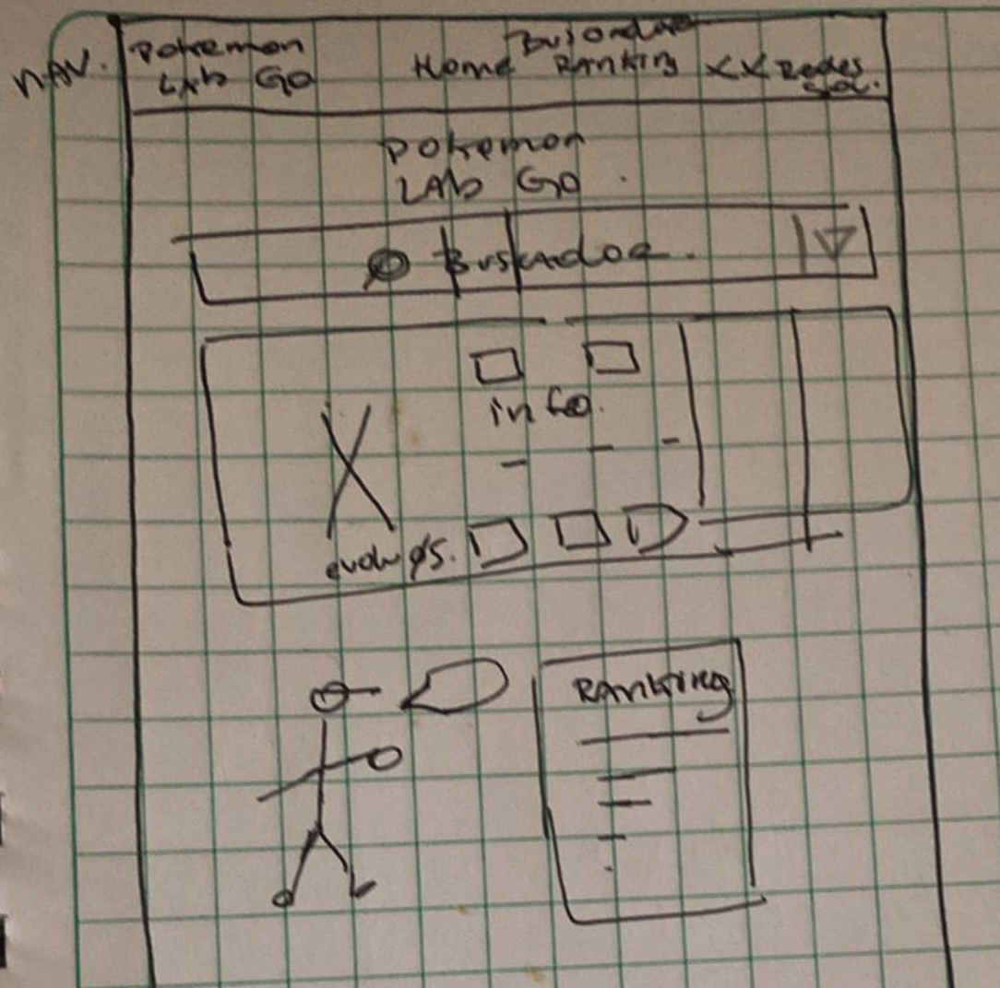
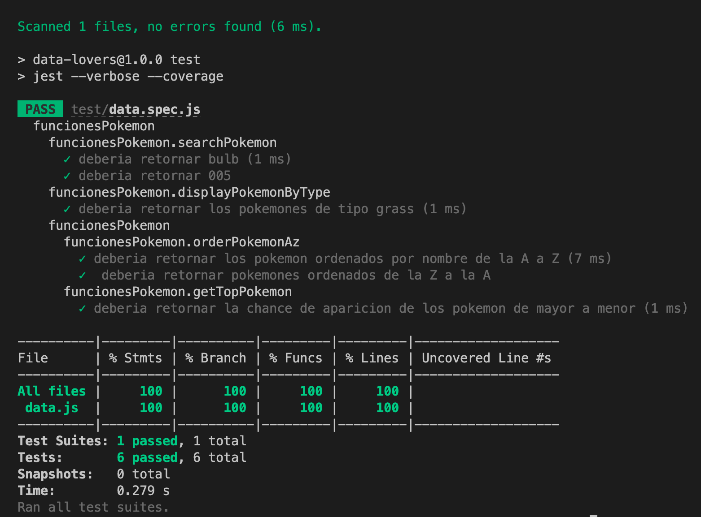

# Data Lovers

## Índice

* [1. Preámbulo](#1-preámbulo)
* [2. Definición del proyecto](#2-definición-del-proyecto)
* [3. Consideraciones generales](#3-consideraciones-generales)
* [4. Tecnologías Utilizadas](#4-tecnologías-utilizadas)
* [5. Flujo de trabajo](#5-flujo-de-trabajo)
* [6. Estructura de archivos](#6-estructura-de-archivos)
* [7. Pruebas unitarias](#7-pruebas-unitarias)
* [8. Interfaz desplegada](#8-interfaz-desplegada)
* [9. Desarrolladoras ](#9-desarrolladoras)

***

## 1. Preámbulo

El objetivo de este proyecto es adquirir conocimientos en la manipulación de datos y ganar experiencia en el trabajo colaborativo a través de una situación y contexto ficticios. Nuestro objetivo es diseñar una interfaz interactiva que permita visualizar, filtrar y ordenar datos.

## 2. Definición del proyecto

Nuestro proyecto se llama **Pokemon Lab Go**, durante el proceso de diseño de la interfaz, deberemos tener en cuenta las necesidades y expectativas de nuestros usuarios. Comprender quiénes son nuestros usuarios y qué información desean visualizar y explorar. Con base en esta comprensión, crearemos una interfaz amigable y fácil de usar que satisfaga las necesidades de nuestros usuarios.

Al finalizar este proyecto, habremos adquirido habilidades en la manipulación de datos, el diseño de interfaces de usuario, el trabajo colaborativo en equipo y el desarrollo web utilizando HTML, CSS y JavaScript. Estaremos preparados para enfrentar desafíos técnicos y brindar soluciones efectivas a problemas de visualización de datos con el uso de _Una single page application (SPA)_, es un tipo de aplicación web que carga una única página inicial desde el servidor y luego actualiza dinámicamente su contenido, mediante las interacciones del usuario, sin necesidad de cargar páginas adicionales del servidor.

Para esto se nos proporciono los siguientes datos:

* [Pokémon](src/data/pokemon/pokemon.json):
  En este set encontrarás una lista con los 251 Pokémon de la región de Kanto y Johto, junto con sus respectivas estadísticas usadas en el juego
  [Pokémon GO](http://pokemongolive.com).
  - [Investigación con jugadores de Pokémon Go](src/data/pokemon/README.md)

## 3. Consideraciones Generales

* Este proyecto se desarrollo en duplas
* El rango de tiempo estimado para completar el proyecto fue de 3 a 4 Sprints.
* El proyecto fue entregado subiendo nuestro código a GitHub (commit/push) y la interfaz fue desplegada usando GitHub Pages.
* El proyecto debe estar implementada completamente en JavaScript (ES6), HTML y CSS. (sin uso de librerias)

## 4. Tecnologías utilizadas

**Trello**: Es una plataforma de gestión de proyectos y organización colaborativa basada en tableros. Permitendo crear listas, tarjetas para visualizar y organizar tareas del proyecto.

**Figma**: Es una herramienta de diseño de interfaces de usuario, que permite crear, colaborar y prototipar diseños de manera eficiente y efectiva.

**HTML**: Es un lenguaje utilizado para estructurar y presentar contenido en la web, proporcionando elementos y etiquetas para crear y dar la estructura de una página.

**JavaScript**: Es un lenguaje de programación que se utiliza para agregar interactividad y funcionalidad a las páginas web, permitiendo crear efectos dinámicos, manipular datos y responder a las acciones del usuario.

**CSS**: Es un lenguaje de estilo utilizado para definir la presentación y apariencia visual de una página web, permitiendo controlar el diseño, el formato y los estilos de los elementos en el HTML. Y con su caracteristica de _@media queries_ podemos adapatar el diseño y estilo en función del tipo de dispositivo que el usuario estime para visualizar la página. 

**Git**: Es un sistema de control de versiones que facilita el seguimiento de los cambios en el código fuente, permitiendo gestionar y controlar las distintas versiones del proyecto, facilitando el trabajo colaborativo y la gestión de ramas y fusiones.

**GitHub**: Es una plataforma online basada en _Git_ que ofrece alojamiento de repositorios remotos y herramientas colaborativas, permitiendo compartir, colaborar y gestionar proyectos de forma más sencilla

**Github Pages**:  Permite a los usuarios de _GitHub_ crear y compartir sitios web públicos para proyectos, documentación, portafolios, etc.

**Jest**: Es un framework de pruebas unitarias de _JavaScript_, permite realizar afirmaciones y crear casos de prueba para verificar si el código se comporta como se espera.

## 5. Flujo de trabajo

Para establecer un flujo de trabajo eficiente, comenzamos organizando nuestro espacio en **Trello**. Segmentamos todas las tareas requeridas en el proyecto, los objetivos de aprendizaje, las historias de usuario y los prototipos de baja y alta fidelidad. Progresivamente, profundizamos en cada uno de ellos, dividiéndolos en categorías como _"Sprint Backlog"_ (por hacer en la semana), _"En proceso"_ y _"Hecho"_. También creamos una tarjeta para los bloqueos con el fin de mantener un desarrollo de proyecto ordenado y estructurado. Este enfoque nos permitió tener una visión clara de las tareas pendientes y su progreso, lo que contribuyó a un desarrollo efectivo del proyecto.

### Perfil del usuario

Nuestro producto **"Pokemon Lab Go"** está dirigido a niños, jóvenes y adultos con intereses relacionados con [_"Pokémon"_](https://es.wikipedia.org/wiki/Pok%C3%A9mon) y sus derivados como [_"Pokémon Go"_](https://pokemongolive.com/?hl=es), [_"Pokémon Go Plus+"_](https://www.pokemongoplusplus.com/es-ES/), [_"Pokémon sleep"_](https://www.pokemonsleep.net/es-ES/).

Para ello, tenemos a disposicion información relevante para formar nuestras historias de usuario.

### Historia de usuario 1


### Historia de usuario 2


### Historia de usuario 3


### Diseño de la Interfaz de Usuario
#### Prototipo de baja fidelidad

En cuanto al diseño de la página, lo primero después de definir el tema a trabajar fue desarrollar un prototipo de baja fidelidad. Para ello realizamos inicialmente bocetos en papel que llevamos posteriormente a Figma.

##### _Boceto en papel_:


##### _Prototipo en Figma_:


#### Prototipo de alta fidelidad

Tras las primeras iteraciones realizamos el prototipo de alta fidelidad en la cual definimos una paleta de colores inicial, priorizado que fuesen iconicas de "Pokémon".


##### _Prototipo en Figma_:


#### Testeos de usabilidad

Durante los testos de usabilidad se nos da el feedback de modificar las _“CATEGORIAS”_ y los sub-menus desglosarlos en el _nav_, y que solo _tipos_ tenga la posibilidad de desplegar, ya que formaba mucho "ruido visual".

Y tras las modificaciones correspondientes quedo así:


Para interactuar con los últimas cambios realizados en **Figma** de nuestro prototipo de alta fidelidad [haz click aqui](https://www.figma.com/proto/pidKRNIkKzxTi7C86XmXJc/Prototipo-alta-DL?type=design&node-id=1-5&t=hoRF5R4XbQ2Csy5X-0&scaling=scale-down&page-id=0%3A1&starting-point-node-id=1%3A5)


Para realizar la búsqueda por nombre de nuestro prototipo en **Figma**


## 6. Estructura de archivos

El proyecto está organizado de la siguiente manera:

```text
.
├── EXTRA.md
├── README.md
├── package.json
├── src
|  ├── assets
|  ├── data 
|  |  ├── pokemon
|  |  |  ├── pokemon.js
|  |  |  ├── pokemon.json
|  |  |  └── README.md
|  ├── img
|  ├── data.js
|  ├── index.html
|  ├── main.js
|  └── query.css
|  └── style.css
└── test
   └── data.spec.js
```

### `src/assets`: Contiene las imágenes correspondientes a cada tipo de Pokémon.

### `src/data`: En este set se encuentra una lista con los 251 Pokémon de la región de Kanto y Johto, junto con sus respectivas estadísticas usadas en el juego.

### `src/assets`: Contiene las imágenes utilizadas tanto en la página, como las utilizadas en este Readme.

### `src/data.js`: Contiene un objeto llamado "funcionesPokemon" que contiene varias funciones relacionadas con la manipulación y filtrado de datos de Pokémon. La cual se exporta al final del código utilizando export default, lo que permite que estas funciones estén disponibles para su uso en otros archivos que importen este módulo.
### `src/index.html`: Proporciona la estructura, los estilos, los recursos y la funcionalidad necesarios para construir una página web completa y efectiva.

### `src/main.js`: Se importa las funciones de 'data.js' y crea una página web interactiva que muestra información de los Pokémon, en "cards" que permiten que se abra una modal y proporciona opciones de búsqueda y ordenamiento, y muestra un ranking basado en la probabilidad de aparición de los Pokémon.

### `src/style.css`: Este archivo contiene los estilos CSS del sitio web, aplicados para darle una apariencia visual atractiva.

### `src/query.css`: Aquí se aplican todos los @media query, para que el diseño de la página sea responsivo y amigable para los usuarios en una diversa gama de dispositivos.

### `test/data.spect.js`: Este es un archivo de pruebas (test) escrito en Jest para garantizar que las funciones del módulo funcionesPokemon se comporten correctamente y produzcan los resultados deseados`

## 7. Pruebas unitarias

Estos test contribuyen al mantenimiento y la calidad del código, permiten detectar rápidamente problemas que puedan surgir tras cambios en el código. 



## 8. Interfaz desplegada
### Versión escritorio 
Esta es la interfaz final de la aplicación web en la vista de escritorio.

### Versión tableta 
Esta es la interfaz final de la aplicación web en la vista de tableta equivalente a 720 px.

### Versión móvil
Esta es la interfaz final de la aplicación web en la vista de movil equivalente a 480 px. 

## 9. Desarrolladoras

* [Nancy A. Mendoza (MX)](https://github.com/nancyale24/)

* [Paulina Torres (CL)](https://github.com/Paulytorres/)

